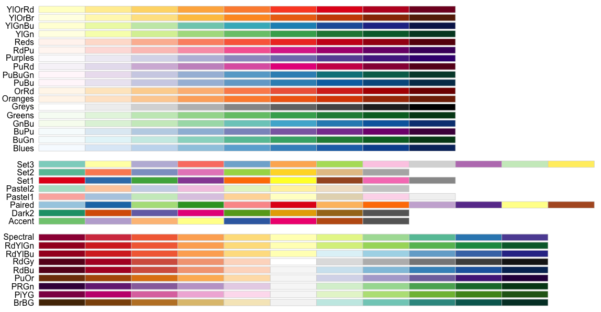

Heatmaps
========

Heatmaps are often more informative than average plots. If there is variability in signal along individual instances of a given genomic feature (e.g., because there are different biological classes), an average plot might not represent the behavior of any individual feature and could even give a misleading picture. SeqPlots plots track-feature pairs as sub-heatmaps horizontally aligned on single figure. All sub-heatmaps must have the same number of data rows, hence in single plot mode simultaneous plotting is possible only on single features or feature files containing exact same number of rows. The heatmaps can be sorted and clustered by k-means, hierarchical clustering or super self organising maps (SupreSOM).

Heatmap setup tab
-----------------

This tab has heatmap specific options for data processing and display.

> 

* **`Sort heatmap rows by mean signal`** - sorts the heatmap rows based on the mean value of each row across included sub-heatmps. Can be set to increasing or decreasing order. Turned off by default.

* **`Clustering algorithm`** - choose clustering algorithm (k-means, hierarchical or SupreSOM).  If clustering is not desired, choose  *`do not cluster`*, which uses the feature file in the uploaded order . K-means by default.

* **`Make cluster calculation repeatable`** - enforces, that clustering with non-deterministic algorithms, like k-means or SupreSOM will generate the same results as most recently plotted heatmap. This is achieved by re-using R random number generator seed.

* **`Plot selected cluster`** - this option is available only if `Make cluster calculation repeatable` is turned on. Allows to select one of the clusters and zoom it to whole plot height. Plot all clusters by default.

* **`Choose individual heatmaps for sorting/clustering`** - this checkbox brings up a new control panel on the **plot set grid** to determine if a given sub-heatmap should be included in plotting and/or clustering. The excluded sub-plots will be plotted in the order of the other sub-heatmaps, but their values will not influence the clustering/sorting. By default all sub-heatmaps are included.

* **`Heatmaps have individual color keys`** - by default all sub-heatmap have their own color keys. This option determines if each sub-heatmap should have a separate color key (plotted below the heatmap) or a single, common key should be calculated for all sub-plots (plotted rightmost).  The example below show the difference between separate (left) and common (right) color keys:

    > 

* **`Set default color key limits`** - this option determines the limits in mapping the numerical values to the colors. The range of colors generated is dependent on these options. Values lower or higher than the given limits will be plotted in the limit value color. If this checkbox is not selected, limits are auto-generated using **`Color key scaling`** parameter. If this option it turned off two numerical fields, **`min`** and **`max`**, are shown to manually set the limits.

    * **`Color key scaling`** - this slider influences how color key limits are generated. For example, 0.01 (default value) calculates limits using data ranging from 1-99 percentile of available data points. 0.1 uses data ranging from 10-90 percentile. The general formula for limit is: [quantile(data, `Color key scaling`); quantile(data, 1-`Color key scaling`)]
    * **`min`** and **`max`** numeric inputs - enter values to manually specify color key limits as numeric values.

* **`Set individual color key limits`** - this option is similar to manual set up of color key limits, but this allows one to specify different values for individual sub-heatmaps. When this checkbox is selected **`min`** and **`max`** numeric input menu is shown on the **plot set grid**

* **`Set colorspace`** - This input allows to use color palettes from RColorBrewer package, which would replace default color palette for heatmaps. By selecting **`Reverse`** checkbox the reversed color palette will be used.
Here are available color pallets (click [here](http://przemol.github.io/plotsHg19/ColorMapTests) to see example heatmap plotted with different color palettes):

    

    When the `Custom` option is selected three-color pickers are shown to setup custom color mappings for heatmaps. The following example below shows standard jet colors (left), default blue color mapping after selecting the checkbox (middle) and custom color selection (right):

    

Other options controlling heatmap appearance
--------------------------------------------

The heatmap output shares many display options from other tabs. Here we provide a list of these inputs, please refer to ["Viewing and manipulating plots"](Viewing%20and%20manipulating%20plots) for further reference.

* **Titles and axis panel** 
    * `X-axis label` - Label shown below horizontal axis, drawn separately for each sub-heatmap; default empty
    * `Y-axis label` - Label shown next to vertical axis, drawn separately for each sub-heatmap; default empty
    * `Labels font size` - Font size for axis labels and main labels of sub-heatmaps; default 16 points
    * `Axis font size` - Controls axis ticks font size; default 14 points
    * `Set X-axis limits` - Set hard plotting limits for X-axis; default values are whole range chosen during plot set calculation

* **Guide lines and data scaling panel**
    * `Transform signal` - if set to *`Log2 transform`* performs log2 transformation of the signal prior to plotting; default setting is *`Do not transform`*
    * `Show vertical guide line` - show the vertical line at point 0 - beginning of the feature or midpoint and end of the pseudo-length scaled features (only for anchored plots); turn on by default

* **Keys, labels and colors panel**
    * `Colors` - for hetmaps this input allows to control the color mapping of specific sub-heatmaps. The map starts with white (for low color key limit) and finishes with selected color (for high color key limit).
    * `Label` - allows to set up custom sub-heatmap top labels
    * `Priority/Order` - Use this to place heatmaps in your desired order.  The feature-track pairs with the highest priority will be plotted as left-most sub-heatmaps. 
    * `Legend font size` - control the font size of common color key, inactive if heatmaps have individual color keys; 12 default

