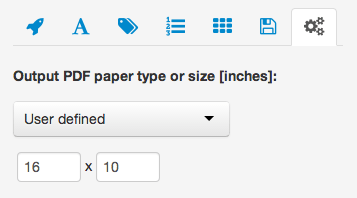

Getting PDFs and cluster info
=============================

Plots can be downladed as PDFs by clicking `Line plot` or `Heatmap` buttons in the "Download:" section of the **tool panel** (above the plot preview).

> 

The small buttons next to `Line plot` and `Heatmap` produce additional output files:

* the `i` button next to `Line plot` downloads the PDF containing average plot keys
* `cluster diagram` button next to `Heatmap` downloads a cluster report giving cluster assignments and sorting order for each feature as a comma separated value (CSV) spreadsheet.

The cluster report contains following columns:

* ```chromosome``` - the name of chromosome, contig or scaffold
* ```start``` - start of the feature (1 based chromosomal coordinate)
* ```end``` - end of the feature (1 based chromosomal coordinate)	
* ```width``` - width of the feature in base pairs
* ```strand``` - strand	of the feature
* ```metadata_...``` - annotation columns present in the original GFF/BED e.g. gene name, score, group 
* ```originalOrder``` - number of feature (row) in GFF/BED, can be used to restore original order after sorting on cluster ID
* ```ClusterID``` - the numeric ID of the cluster.  The topmost cluster on the heatmap is annotated with 1, and the bottom cluster with k, where k equals to number of clusters selected, exported only if clustering is enabled
* ```SortingOrder``` - the order imposed on heatmap by sorting by mean row(s) values, exported only if sorting is enabled
* ```FinalOrder``` -  the final order of heatmap's rows, this can be influenced by sorting and clustering; 1 indicates topmost row

Sample report:
\footnotesize

```
chromosome	start	end		width	strand	metadata_group	originalOrder	ClusterID	SortingOrder	FinalOrder
chrI		9065087	9070286	5200	+		g1				1				1			3				3
chrI		5171285	5175522	4238	-		g1				2				3			50				43
chrI		9616508	9618109	1602	-		g1				3				3			13				43
chrI		3608395	3611844	3450	+		g1				4				3			11				12
```

\normalsize

Table view:
\scriptsize

| chromosome  | start     | end       | width     | strand | metadata_group | originalOrder | ClusterID | SortingOrder | FinalOrder |
| ----------- | --------- | --------- | --------- | ------ | -------------- | ------------- | --------- | ------------ | ---------- |
| chrI        | 9065087   | 9070286   | 5200      | +      | g1             | 1				      | 1			    | 3	           | 3          |
| chrI        | 5171285	  | 5175522	  | 4238      |	-		   | g1             | 2				      | 3			    | 50				   | 43         |
| chrI		    | 9616508	  | 9618109	  | 1602	    | -		   | g1				      | 3				      | 3			    | 13				   | 43         |
| chrI		    | 3608395	  | 3611844	  | 3450	    | +		   | g1				      | 4				      | 3			    | 11				   | 12         |

\normalsize

PDF output size
---------------
The last tab (`Batch operation and setup`) on the **tool panel** includes batch operations and various other settings including PDF output size. By default the output PDF will be A4 landscape. This can be changed using the drop-down list to following settings:

* `user defined` - this option reveals two numeric inputs that allows to set output PDF width and height. The values must be given in inches.
* `Legal rotated` - US Legal landscape: 14" by 8.5"
* `A4` - A4 portrait: - 8.27" × 11.69"
* `Letter` - US Letter portrait: 8.5" × 11"
* `Legal` - US Legal portrait: 8.5" × 14"
* `Executive` - a.k.a Monarch paper: 7.25 × 10.5"

> 

